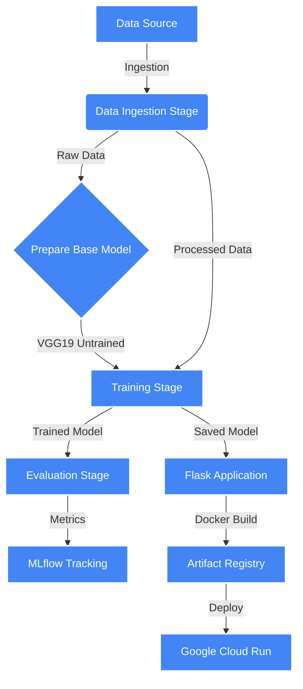

# End-to-End Brain Tumor Classification

A state-of-the-art Deep Learning project designed to classify brain tumors from MRI scans. This application leverages a robust MLOps pipeline using MLflow for experiment tracking, DVC for data version control, and TensorFlow for high-performance model training. The final model is containerized with Docker and deployed on Google Cloud Run for serverless scalability.

 
 
 
 
 
 


---

## 🩺 Problem Statement

Brain tumors are a significant health concern worldwide, and early detection is critical for effective treatment. Radiologists often rely on MRI scans to identify abnormalities, but manual interpretation can be time-consuming and subject to inter-observer variability.

**The Solution:** This project automates the classification process using **Transfer Learning with the VGG19 architecture**. By fine-tuning this pre-trained model on a dataset of Brain MRI images, we assist medical professionals with rapid, consistent assessments across 4 classes (e.g., Glioma, Meningioma, Pituitary, No Tumor).

---

## 📌 Technical Highlights

- **Transfer Learning:** Utilizes **VGG19** (19 layers, pre-trained on ImageNet) to achieve high accuracy with a specialized medical dataset.
- **Pipeline Orchestration:** **DVC** manages the entire machine learning pipeline (Ingestion -> Preparation -> Training -> Evaluation), ensuring full reproducibility.
- **Experiment Tracking:** **MLflow** tracks experiments, logging metrics (accuracy, loss) and parameters to a remote server (DAGsHub).
- **Serverless Deployment:** Automatically builds and deploys to **Google Cloud Run** via GitHub Actions, featuring a highly optimized Docker container with system-level dependencies for computer vision.
- **Modern Web UI:** A sleek Flask-based frontend for real-time predictions.

---

## 🏗️ Project Structure

```bash
├── .github/                # CI/CD workflows for Google Cloud Deployment
├── config/                 # Configuration files (config.yaml)
├── src/                    # Source code
│   └── classifier/         # Main package
│       ├── components/     # Logic for each pipeline stage (Ingestion, Training, etc.)
│       ├── config/         # Configuration managers
│       ├── entity/         # Data classes for config
│       ├── pipeline/       # Pipeline orchestration scripts
│       └── utils/          # Utility functions (common.py)
├── templates/              # HTML templates for Flask UI
├── app.py                  # Flask application entry point
├── main.py                 # Main pipeline runner
├── dvc.yaml                # DVC pipeline definition
├── params.yaml             # Hyperparameters definitions
├── Dockerfile              # Container configuration
└── requirements.txt        # Project dependencies
```

---

## Project Picture Output


---

## 🔄 Pipeline Flowchart



---

## 🛠️ Pipeline Stages (MLOps)

1. **Data Ingestion:** Downloads the Brain Tumor dataset from the source URL.
2. **Prepare Base Model:** Loads the **VGG19** model (excluding top layers) and saves it.
3. **Training:** Fine-tunes the model on the dataset with data augmentation (SGD Optimizer, Categorical Crossentropy).
4. **Evaluation:** Evaluates the trained model on a test set and logs metrics to MLflow.

---

## ☁️ Google Cloud Deployment Guide

This project features a fully automated CI/CD pipeline that deploys the application to **Google Cloud Run** whenever changes are pushed to the main branch.

### 1. GCP Setup
1. **Create a Google Cloud Project:** Note your `PROJECT_ID`.
2. **Enable APIs:**
   - Cloud Run Admin API
   - Cloud Build API
   - Artifact Registry API
3. **Create Artifact Registry:**
   - Go to **Artifact Registry** -> Create Repository.
   - **Name:** `brain-tumor-classification` (or your preferred name)
   - **Format:** Docker
   - **Region:** `us-central1` (or your preferred region).

### 2. Service Account Setup
Create a Service Account to verify identity from GitHub Actions:

```bash
# Create Service Account
gcloud iam service-accounts create github-deploy-sa --display-name="GitHub Actions Deployer"

# Grant Permissions (Cloud Run Admin, Storage Admin, Service Account User, Artifact Registry Writer)
gcloud projects add-iam-policy-binding <PROJECT_ID> \
    --member="serviceAccount:github-deploy-sa@<PROJECT_ID>.iam.gserviceaccount.com" \
    --role="roles/run.admin"

gcloud projects add-iam-policy-binding <PROJECT_ID> \
    --member="serviceAccount:github-deploy-sa@<PROJECT_ID>.iam.gserviceaccount.com" \
    --role="roles/iam.serviceAccountUser"

gcloud projects add-iam-policy-binding <PROJECT_ID> \
    --member="serviceAccount:github-deploy-sa@<PROJECT_ID>.iam.gserviceaccount.com" \
    --role="roles/artifactregistry.writer"
```

### 3. GitHub Secrets Configuration
Go to your **GitHub Repository** -> **Settings** -> **Secrets and Variables** -> **Actions** -> **New Repository Secret**.

| Secret Name | Value |
|-------------|-------|
| `GCP_SA_KEY` | The JSON Key content of the Service Account created above. |

### 4. Handling Large Models
Since our trained model (`trained_model.h5`) is ~57MB (or larger), it usually fits within GitHub's file limits. We force-add it to the repository to ensure it's available in the Docker container if it's not generated during build:

```bash
git add -f artifacts/training/trained_model.h5
git commit -m "Add model file"
git push origin main
```

**For Larger Models (>100MB):**
1. Upload the model to **Google Cloud Storage (GCS)** manually.
2. Update `app.py` to download the model from GCS on startup using the `google-cloud-storage` library.
3. Grant **Storage Object Viewer** role to your Cloud Run service account.

### 5. Deployment
Push your code to the `main` branch. The GitHub Action in `.github/workflows/main.yaml` will:
1. Authenticate with Google Cloud.
2. Build the Docker image (installing system dependencies like `libgl1` for OpenCV).
3. Push the image to Google Artifact Registry.
4. Deploy the service to Cloud Run with optimized memory (2Gi) and timeout (300s) settings.

---

## 🚀 Getting Started

### Prerequisites
- Python 3.10+
- Docker (optional, for local container testing)
- Google Cloud Account (for deployment)

### Local Installation
1. **Clone the repository:**
   ```bash
   git clone https://github.com/DarkFoot101/animal-disease-classification-with-llm.git
   cd animal-disease-classification-with-llm
   ```

2. **Install dependencies:**
   ```bash
   pip install -r requirements.txt
   ```

3. **Run the pipeline:**
   ```bash
   dvc repro
   ```

4. **Start the App:**
   ```bash
   python app.py
   ```
